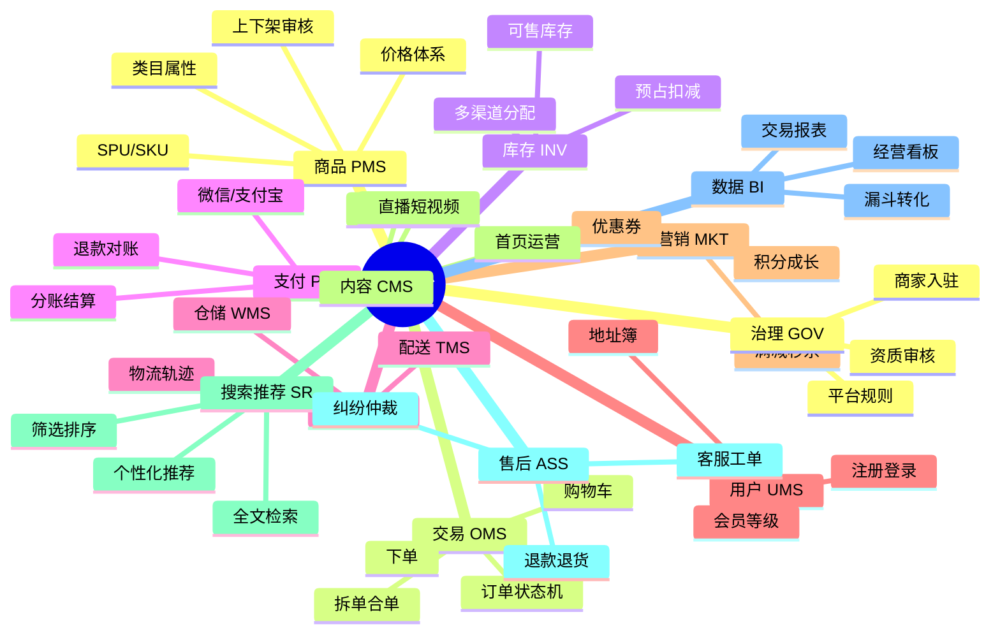
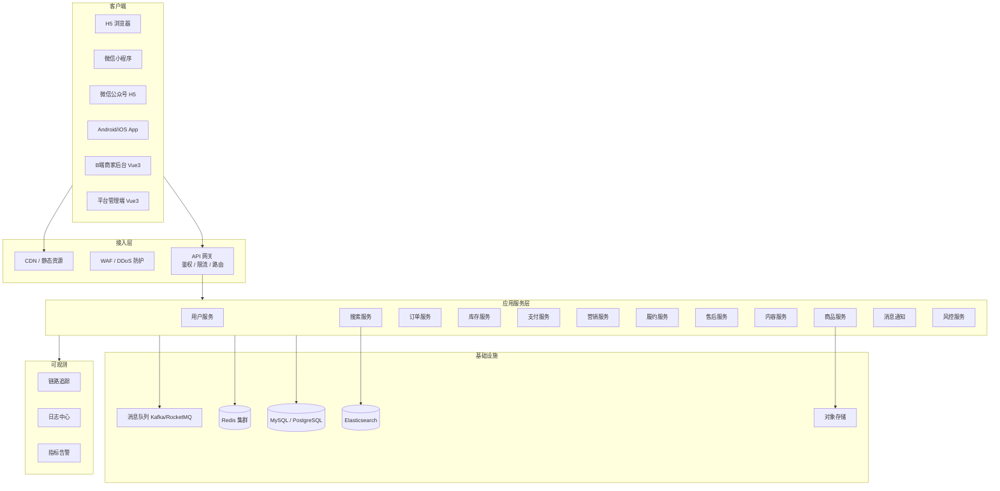
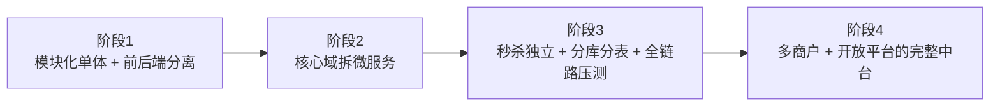
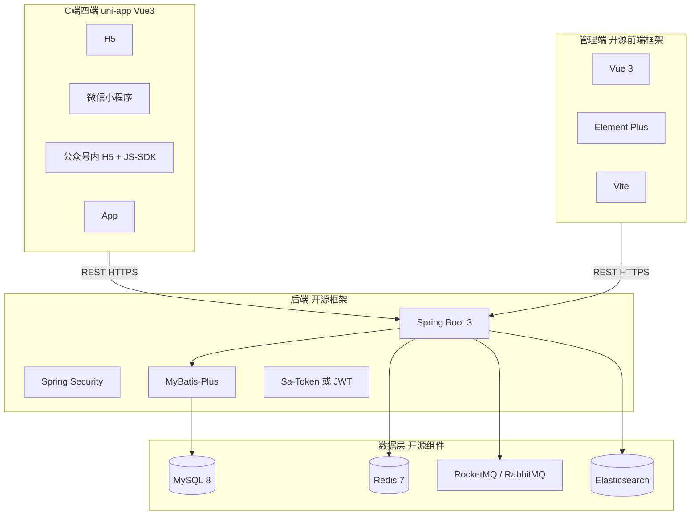
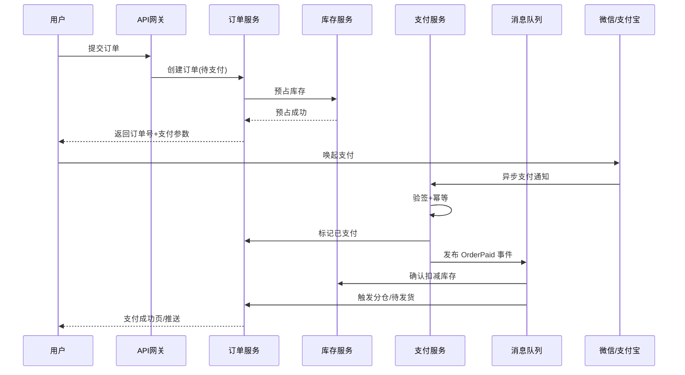
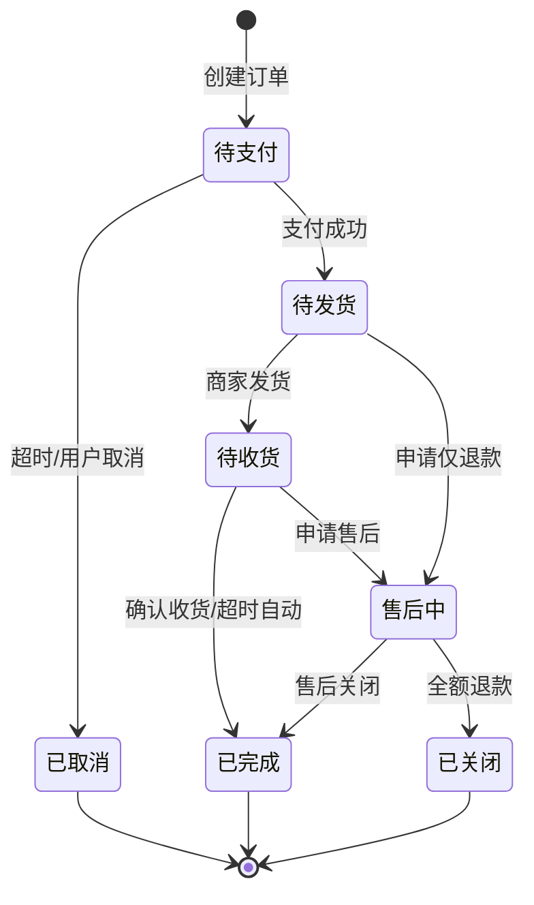
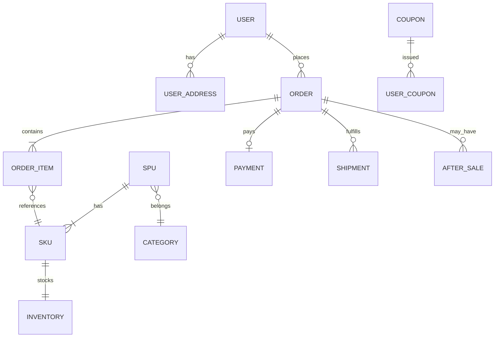
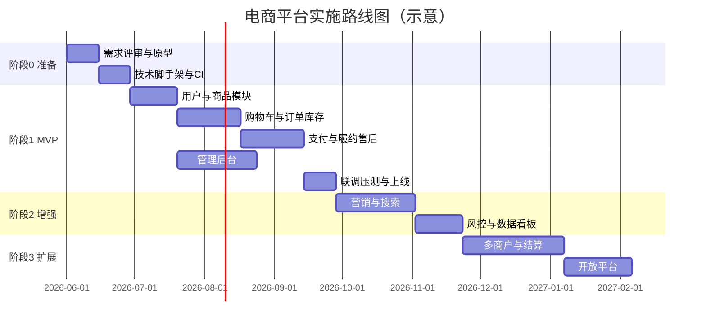

# 高品质电商平台 — 开发设计文档

> **文档版本**：v1.1  
> **编写日期**：2026-05-25  
> **更新说明**：v1.1 确认采用**开源框架全栈**，终端覆盖 **H5 + 微信小程序 + 微信公众号 + App**  
> **项目阶段**：技术选型已确认，待进入脚手架与 MVP 开发  
> **目标**：前后端分离、可水平扩展、支撑高并发与促销峰值的自营/平台型电商系统

---

## 目录

1. [项目概述](#1-项目概述)
2. [行业调研：主流平台应具备的核心能力](#2-行业调研主流平台应具备的核心能力)
3. [业务域划分与功能清单](#3-业务域划分与功能清单)
4. [非功能性需求](#4-非功能性需求)
5. [总体技术架构](#5-总体技术架构)
6. [开源技术栈选型（已确认）](#6-开源技术栈选型已确认)
7. [核心业务流程设计](#7-核心业务流程设计)
8. [数据架构概要](#8-数据架构概要)
9. [接口与前后端协作规范](#9-接口与前后端协作规范)
10. [安全、合规与风控](#10-安全合规与风控)
11. [可观测性与运维](#11-可观测性与运维)
12. [分阶段实施路线图](#12-分阶段实施路线图)
13. [风险与决策待定项](#13-风险与决策待定项)
14. [附录：术语表与参考](#14-附录术语表与参考)

---

## 1. 项目概述

### 1.1 背景

您已具备营业执照等经营资质，具备合法开展电商业务的基础条件，但缺少支撑交易闭环的数字化系统。本项目建设目标是对标淘宝、京东、拼多多、Amazon、Shopify 等主流平台所验证的能力模型，建设一套**可演进、可扩展**的电商技术体系，而非一次性堆砌全部功能。

### 1.2 建设原则

| 原则 | 说明 |
|------|------|
| **业务闭环优先** | 先打通「浏览 → 下单 → 支付 → 履约 → 售后」主链路，再扩展营销、推荐、开放平台 |
| **前后端分离** | 消费者端（C 端）、商家/运营端（B 端）、平台管理端独立前端，统一 API 网关 |
| **领域驱动拆分** | 按商品、交易、库存、支付、履约等业务域拆服务，避免按技术层拆分的碎片化 |
| **最终一致性** | 分布式环境下订单-库存-支付采用 Saga + 幂等 + 状态机，不强求跨库 ACID |
| **可观测可回滚** | 全链路 Trace、业务指标与发布策略（灰度/金丝雀）从第一期纳入 |

### 1.3 平台形态（需后续确认）

文档默认支持以下两种模式的**技术底座共用**，通过配置与权限区分：

- **模式 A — 自营电商**：单一经营主体，商品、库存、客服由平台自营。
- **模式 B — 平台型（多商户）**：入驻商家管理店铺、商品与部分履约，平台负责交易、支付分账、结算与治理。

> **决策点**：首期建议以**自营 MVP** 上线验证，预留多商户扩展字段与结算模块接口。

### 1.4 终端覆盖（已确认）

| 终端 | 实现方式 | 说明 |
|------|----------|------|
| **H5** | uni-app 编译为 H5 | 浏览器、微信内网页均可访问 |
| **微信小程序** | uni-app 编译为 `mp-weixin` | 主力交易场景，需企业主体小程序 |
| **微信公众号** | 同一套 H5 + 微信 JS-SDK | 服务号菜单/图文跳转商城；网页授权登录、分享、支付 |
| **App（Android/iOS）** | uni-app 云打包 / 离线打包 | 应用商店上架需软著与隐私合规 |

四端共用 **一套 uni-app 业务代码 + 统一 REST API**，通过条件编译处理各端差异（登录、支付、分享、推送）。

---

## 2. 行业调研：主流平台应具备的核心能力

综合淘宝/天猫、京东、拼多多、Amazon、Shopify 及行业架构实践，真正可运营的电商平台能力可归纳为 **12 大域 + 3 条横切能力**。

### 2.1 十二大核心业务域



| 域 | 英文缩写 | 主流平台典型能力 | 首期优先级 |
|----|----------|------------------|------------|
| 商品管理 | PMS | 类目树、SPU/SKU、规格、媒体、上下架、价格（原价/活动价）、商品审核 | **P0** |
| 订单交易 | OMS | 购物车、结算、下单、订单拆分、状态流转、超时关单 | **P0** |
| 库存 | INV | 可售数、预占、扣减、回滚、安全库存、（多仓）分仓 | **P0** |
| 支付 | PAY | 聚合支付、支付回调、退款、对账、（平台）分账 | **P0** |
| 履约物流 | LMS | 电子面单、发货、签收、轨迹查询、运费模板 | **P1** |
| 用户会员 | UMS | 手机/三方登录、实名、地址、会员等级、积分 | **P0** |
| 营销促销 | MKT | 优惠券、满减、限时购、秒杀（独立流量治理） | **P1** |
| 内容与互动 | CMS | 首页 Banner、商品评价、问大家、店铺装修 | **P1** |
| 搜索推荐 | SR | 关键词搜索、筛选、排序、搜索联想、推荐位 | **P1** |
| 售后服务 | ASS | 仅退款/退货退款、逆向物流、客服会话 | **P1** |
| 供应链采购 | SCM | 采购单、供应商、入库、调拨（自营加深后） | **P2** |
| 财务结算 | FIN | 商家结算、发票、税务报表、资金账户 | **P2** |
| 平台治理 | GOV | 入驻审核、保证金、违规处罚、协议管理 | **P2（多商户）** |

### 2.2 三条横切能力（贯穿全站）

1. **安全与风控**：设备指纹、行为风控、反刷单、黄牛限购、内容合规、敏感数据脱敏。
2. **数据分析与增长**：埋点、转化漏斗、用户分群、A/B 实验、实时/离线数仓。
3. **开放平台**：对外 API、Webhook、OAuth、限流鉴权（对接 ERP、WMS、CRM 时必需）。

### 2.3 与「小商城」的本质差异

| 维度 | 简易商城 | 本项目建设目标 |
|------|----------|----------------|
| 并发模型 | 单库同步扣库存 | 预占 + 异步确认 + 热点隔离 |
| 一致性 | 本地事务 | Saga / 事务消息 / 幂等表 |
| 促销峰值 | 易宕机、超卖 | 秒杀链路独立、缓存 + 队列削峰 |
| 扩展性 | 单体 | 微服务或模块化单体 → 可拆分 |
| 合规 | 薄弱 | 实名、隐私、支付持牌机构、售后法定义务 |

---

## 3. 业务域划分与功能清单

### 3.1 消费者端（C 端 / H5 / App / 小程序）

#### 3.1.1 账户与安全
- 手机号 + 验证码注册/登录（必选）
- 微信/支付宝一键登录（建议二期）
- 实名信息展示（依法展示经营者信息）
- 收货地址 CRUD、默认地址
- 账号注销与个人信息导出（《个人信息保护法》）

#### 3.1.2 商品浏览
- 首页：运营位、类目入口、推荐流
- 类目列表、筛选（价格、品牌、属性）、排序（综合/销量/价格）
- 商品详情：图/视频、SKU 选择、价格、库存、促销标签、评价摘要
- 收藏、浏览历史

#### 3.1.3 交易
- 购物车（登录/未登录合并策略）
- 结算页：商品清单、优惠、运费、应付金额
- 提交订单、收银台、支付结果页
- 订单列表/详情：状态、物流、申请售后

#### 3.1.4 售后
- 申请退款/退货、上传凭证、填写退货物流
- 进度查询、平台介入（可选）

### 3.2 商家/运营端（B 端）

- 商品发布与编辑、SKU 与库存维护
- 订单管理：待发货、已发货、异常单
- 售后审核、退款处理
- 运费模板、发货地址库
- 简易经营数据：订单量、GMV、退款率
- （平台型）店铺装修、子账号权限

### 3.3 平台管理端（Admin）

- 类目与属性模板管理
- 商品/商家审核
- 用户与订单查询、人工关单/退款
- 营销规则配置、优惠券批次
- 风控规则、黑名单
- 系统配置：支付渠道、短信模板、协议文案
- RBAC：角色、菜单、数据权限（按店铺/仓库隔离）

### 3.4 首期 MVP 功能边界（建议）

**必须上线（P0）**  
用户注册登录、商品浏览与 SKU 下单、库存预占、微信/支付宝支付、发货与物流单号、仅退款/退货退款主流程、后台商品与订单管理。

**可二期（P1）**  
优惠券/满减、秒杀、搜索（Elasticsearch）、评价系统、在线客服、消息通知中心。

**可三期（P2）**  
多商户入驻、分账结算、推荐算法、直播、采购与 WMS 深度集成、开放 API。

---

## 4. 非功能性需求

### 4.1 性能与容量（可随业务校准）

| 指标 | 目标值（首期） | 扩展目标 |
|------|----------------|----------|
| 核心 API P99 延迟 | ≤ 300ms（不含支付跳转） | ≤ 200ms |
| 下单接口峰值 | 1,000 TPS | 10,000+ TPS（秒杀独立池） |
| 系统可用性 | 99.9%（年停机 < 8.76h） | 99.95% |
| 支付回调处理 | 30 秒内完成状态推进 | 同上 |

### 4.2 高并发场景策略

| 场景 | 策略 |
|------|------|
| 商品详情读多写少 | CDN + 多级缓存（本地 Caffeine + Redis），热点 Key 分散 |
| 库存扣减 | **预占库存**（Redis 或 DB 乐观锁 version）+ 异步确认；禁止超卖 |
| 秒杀/大促 | 独立域名/链路、请求排队、库存预热、异步下单、验证码/风控 |
| 订单创建 | 异步化非核心步骤（积分、消息、统计）；核心写路径最短 |
| 数据库 | 读写分离、分库分表（按 user_id / order_id 哈希） |

### 4.3 一致性级别

| 业务 | 一致性要求 | 实现手段 |
|------|------------|----------|
| 支付成功 ↔ 订单已支付 | 强一致（业务上） | 支付回调幂等 + 订单状态机 |
| 订单 ↔ 库存 | 最终一致 | Saga：预占 → 支付成功扣减 / 失败释放 |
| 搜索索引 ↔ 商品库 | 最终一致 | Canal/Debezium 或事务消息同步 ES |
| 统计数据 | 弱一致 | 异步埋点 + 数仓 T+1 |

---

## 5. 总体技术架构

### 5.1 逻辑架构图



### 5.2 部署架构（推荐）

- **容器化**：Docker + Kubernetes（或云厂商 ACK/TCKEKS 等托管 K8s）
- **环境**：dev / test / staging / prod 四套隔离
- **网关**：Kong / APISIX / Spring Cloud Gateway / 云 API 网关
- **配置中心**：Nacos / Apollo
- **CI/CD**：GitHub Actions / GitLab CI + 镜像仓库 + 滚动/金丝雀发布

### 5.3 架构演进路径



**建议**：团队初期可采用 **「模块化单体」**（单仓库多模块，清晰边界），在订单量、团队规模达到阈值后再拆独立微服务，降低运维复杂度。文档以下设计按**可拆分的服务边界**描述，实施时可合并部署。

---

## 6. 开源技术栈选型（已确认）

**原则**：前端、后端、数据访问层均使用成熟**开源框架**，不采用商业闭源低代码；C 端四端由 **uni-app** 统一产出，与自建/二开 Java 后端 API 对接。

### 6.1 总体架构：开源框架分层



### 6.2 已确认技术栈一览

| 层次 | 选定开源方案 | 许可证 | 职责 |
|------|--------------|--------|------|
| **C 端（H5/小程序/公众号/App）** | [uni-app](https://uniapp.dcloud.net.cn/) + Vue 3 + [uv-ui](https://www.uvui.cn/) / uView-plus | Apache 2.0（uni-app） | 一套代码多端编译；公众号能力用 `uni-wx-jssdk` / 微信网页授权 |
| **B 端 / 平台管理端** | Vue 3 + Vite + [Element Plus](https://element-plus.org/) + Pinia | MIT | 商品、订单、运营、权限、报表 |
| **后端应用框架** | [Spring Boot 3](https://spring.io/projects/spring-boot) + Spring Web | Apache 2.0 | REST API、事务、安全、定时任务 |
| **安全认证** | Spring Security + [Sa-Token](https://sa-token.cc/) 或 JWT | Apache / MIT | 登录、RBAC、接口鉴权 |
| **ORM / 数据库访问框架** | [MyBatis-Plus](https://baomidou.com/) | Apache 2.0 | CRUD、分页、乐观锁、多租户扩展点 |
| **数据库** | [MySQL](https://www.mysql.com/) 8.0+ | GPL（使用社区版） | 主业务库，InnoDB，utf8mb4 |
| **数据库版本管理** | [Flyway](https://flywaydb.org/) 或 [Liquibase](https://www.liquibase.org/) | Apache 2.0 | 表结构迁移、可重复部署 |
| **缓存** | [Redis](https://redis.io/) 7 | BSD | 会话、库存预占、热点商品、限流 |
| **API 文档** | [Knife4j](https://doc.xiaominfo.com/)（OpenAPI 3） | Apache 2.0 | 前后端联调、契约 |
| **消息队列** | [RocketMQ](https://rocketmq.apache.org/) 或 RabbitMQ | Apache / MPL | 订单事件、异步通知、削峰 |
| **搜索** | [Elasticsearch](https://www.elastic.co/elasticsearch/) 8.x | SSPL（注意许可）/ 可用 OpenSearch 替代 | 商品搜索（二期） |
| **对象存储** | [MinIO](https://min.io/) 或对接云 OSS SDK | AGPL v3（MinIO）/ 云服务 | 商品图、资质文件 |
| **任务调度** | [XXL-JOB](https://www.xuxueli.com/xxl-job/) | GPL 2.0 | 关单、对账、统计（与 mall4j 等方案一致） |
| **构建工具** | Maven 或 Gradle | Apache | 后端多模块 |
| **C 端 IDE** | HBuilderX 或 VS Code + uni-cli | — | 多端编译与真机调试 |

### 6.3 开源电商底座方案对比（二选一 + 二开）

在「全开源 + Java + uni-app 四端」约束下，国内有两套成熟方案可作为**起点**，在其上按本文档做高品质二开（秒杀、风控、分库分表等）：

| 对比项 | **CRMEB Java 版**（推荐优先考虑） | **Mall4j 开源版** |
|--------|-----------------------------------|-------------------|
| 仓库 | [crmeb/crmeb_java](https://github.com/crmeb/crmeb_java) | [gz-yami/mall4j](https://github.com/gz-yami/mall4j) |
| 协议 | **Apache-2.0**（可闭源二开商用） | **AGPL-3.0**（网络服务需开源或购商业授权） |
| 后端 | Spring Boot + MyBatis-Plus + Redis | Spring Boot 3 + MyBatis + Redis |
| 管理端 | Vue3 + Element UI/Plus | Vue3 后台（mall4v） |
| 移动端 | uni-app：**H5 + 公众号 + 小程序 + App** | uni-app + 独立小程序项目 |
| 内置电商模块 | 商品/订单/营销/优惠券/积分/权限等较全 | B2C 核心 SKU、下单流程完整 |
| 适合场景 | 快速落地 + Apache 友好 | 技术栈新（Boot3）、愿接受 AGPL 或买商业版 |

**本项目建议路径**：

1. **首期**：以 **CRMEB Java** 或 **Mall4j** 部署验证业务闭环，同步梳理需替换/增强的模块（库存预占、Saga、秒杀隔离）。  
2. **中长期**：保留 Spring Boot + MyBatis-Plus 模块边界，将通用能力沉淀为独立 `ecommerce-*` 模块，避免与低版本 PHP 版 CRMEB 混用。

若希望**从零搭建**、仅借用管理脚手架，可采用：

- 管理端：**RuoYi-Vue-Plus**（Spring Boot 3 + Vue3 + Element Plus，MIT/Apache）  
- C 端：**uni-app 官方模板** + 自建电商 API  

开发周期长于基于 CRMEB/Mall4j 二开，但架构最干净。

### 6.4 四端技术实现说明

#### 6.4.1 uni-app 条件编译矩阵

| 能力 | H5 | 微信小程序 | 微信公众号 | App |
|------|-----|------------|------------|-----|
| 登录 | 手机号 / 验证码 | `wx.login` + 手机号组件 | 网页 OAuth2.0 静默/用户授权 | 手机号 + 微信开放平台（可选） |
| 支付 | 微信 H5 支付 / 支付宝 | `wx.requestPayment` | 微信 JSAPI 支付（公众号内） | 微信 APP 支付 / 支付宝 |
| 分享 | 链接 + 海报 | `onShareAppMessage` | JS-SDK 自定义分享 | 系统分享 SDK |
| 推送 | — | 订阅消息 | 模板消息（服务号） | 个推 / 极光（开源 SDK 对接） |

```javascript
// 条件编译示例（登录方式分流）
// #ifdef MP-WEIXIN
// 小程序登录逻辑
// #endif
// #ifdef H5
// 区分普通浏览器 vs 微信内：公众号 OAuth
// #endif
// #ifdef APP-PLUS
// App 登录逻辑
// #endif
```

#### 6.4.2 微信公众号接入要点

- 类型建议：**微信认证服务号**（具备网页授权、JS-SDK、模板消息能力）。  
- 公众号内打开的商城页 = **uni-app H5 构建产物**，部署到已备案域名。  
- 配置：JS 接口安全域名、网页授权域名、支付授权目录。  
- 与小程序：**UnionID 打通**（同一开放平台账号下），用户身份合并。  

#### 6.4.3 App 发布

- 使用 **uni-app 云打包** 或本地离线打包生成 Android / iOS 安装包。  
- iOS 需 Apple 开发者账号；Android 各应用市场上架需软著、隐私政策 URL。  
- 支付需申请 **微信开放平台移动应用** 绑定。

### 6.5 推荐仓库结构（基于开源框架自建时）

```
taobao-mall/                          #  monorepo 根目录
├── mall-uni/                         #  C端：uni-app（H5+mp+App）
│   ├── src/
│   │   ├── pages/
│   │   ├── api/                      #  统一请求封装
│   │   ├── utils/wechat.js           #  公众号 JS-SDK 封装
│   │   └── manifest.json             #  各端 appid、权限配置
│   └── package.json
├── mall-admin/                       #  管理端：Vue3 + Element Plus + Vite
├── mall-api/                         #  后端：Spring Boot 3 多模块
│   ├── mall-common/
│   ├── mall-framework/               #  安全、MyBatis-Plus、Redis 配置
│   ├── mall-modules/
│   │   ├── system/                   #  用户权限（可对接 RuoYi 模块）
│   │   ├── product/
│   │   ├── order/
│   │   ├── inventory/
│   │   ├── payment/
│   │   └── promotion/
│   └── mall-job/                     #  XXL-JOB 执行器
├── docs/
│   ├── db/migration/                 #  Flyway SQL
│   └── openapi/
└── docker/docker-compose.yml         #  MySQL + Redis + MQ 本地开发
```

若基于 **CRMEB / Mall4j** 二开，则在 fork 仓库中按上述模块名逐步重构，避免继续在单体内堆叠无边界代码。

### 6.6 版本与环境要求

| 组件 | 版本 |
|------|------|
| JDK | 17 或 21（Spring Boot 3 要求 17+） |
| Node.js | 18 LTS+（管理端与 uni-app 构建） |
| MySQL | 8.0.x |
| Redis | 7.x |
| 微信开发者工具 | 最新稳定版（小程序调试） |

### 6.7 与文档其他章节的关系

- **第 4 节** 高并发指标不变；在开源单体阶段用 Redis 预占 + MQ 即可，流量上来再拆服务。  
- **第 7 节** 订单状态机、Saga 为二开必做项，开源底座需对照补齐。  
- **第 10 节** 公众号/小程序支付、商户号配置依微信官方文档实施。

---

## 7. 核心业务流程设计

### 7.1 下单支付主链路（时序）



### 7.2 订单状态机



**关键规则**：
- 待支付订单 **T+30min**（可配置）自动关单并释放预占库存。
- 状态变更仅允许通过**状态机服务**转换，禁止跨状态跳跃更新。
- 所有外部回调（支付、物流）必须 **幂等**（唯一键：`channel + out_trade_no`）。

### 7.3 库存模型

| 概念 | 说明 |
|------|------|
| 物理库存 | 仓库实际数量（对接 WMS 时同步） |
| 可售库存 | 前台可卖数量 = 物理 - 锁定 - 安全库存 |
| 预占库存 | 下单未支付占用，支付成功转扣减，关单释放 |
| 活动库存 | 秒杀/拼团独立库存池，与日常可售隔离 |

**并发控制**：`UPDATE inventory SET available = available - ? WHERE sku_id = ? AND available >= ?` 或 Redis `DECR` + 异步落库；高并发秒杀采用 **令牌桶 + 队列** 异步创建订单。

### 7.4 分布式事务：推荐 Saga（编排型）

订单支付成功后的典型 Saga 步骤：

1. 确认扣减库存 — 失败 → 发起退款 + 订单异常
2. 生成履约单 — 失败 → 补偿库存（视业务是否已扣减）
3. 发送通知 / 积分 — 失败 → 重试（幂等），不阻塞主单

**不首选强分布式 2PC**；支付结果以支付渠道回调为权威来源。

### 7.5 消息可靠性

- **事务外盒（Transactional Outbox）**：业务写库与写 Outbox 表同事务，CDC 投递 MQ。
- **消费幂等**：`message_id` 唯一索引或 Redis 去重。
- **死信队列（DLQ）**：超过最大重试进入 DLQ，运营后台可重放。

---

## 8. 数据架构概要

### 8.1 核心实体关系（逻辑）



### 8.2 分库分表策略（成长期）

| 表 | 拆分建议 |
|----|----------|
| `order` / `order_item` | 按 `user_id` 哈希，16~64 库表 |
| `payment_notify_log` | 按时间分区 |
| `user` | 按 `user_id` 或手机号哈希 |
| `product` / `sku` | 读多写少，主库 + 缓存，后期可按 `shop_id` 拆 |

### 8.3 缓存 Key 设计示例

| Key | TTL | 说明 |
|-----|-----|------|
| `product:detail:{spuId}` | 5~30min | 商品详情，更新时主动失效 |
| `sku:stock:{skuId}` | 实时性高则短 TTL + 写穿 | 可售库存 |
| `cart:{userId}` | 7d | 登录购物车 |
| `seckill:stock:{activityId}` | 活动周期 | 秒杀独立库存 |

### 8.4 搜索索引

- 索引字段：标题、副标题、品牌、类目、价格、销量、上架时间、标签。
- 同步方式：商品变更发事件 → 搜索服务消费更新 ES。
- 中文分词：IK Analyzer。

---

## 9. 接口与前后端协作规范

### 9.1 REST 约定

- 基础路径：`/api/v1/`
- 认证头：`Authorization: Bearer <access_token>`
- 统一响应：

```json
{
  "code": 0,
  "message": "success",
  "data": {},
  "traceId": "abc123",
  "timestamp": 1716633600000
}
```

- 业务错误码分段：`1xxxx` 用户、`2xxxx` 商品、`3xxxx` 订单、`4xxxx` 支付、`5xxxx` 营销

### 9.2 核心 API 清单（首期）

| 模块 | 方法 | 路径 | 说明 |
|------|------|------|------|
| 用户 | POST | `/auth/sms/send` | 发送验证码 |
| 用户 | POST | `/auth/login` | 登录 |
| 商品 | GET | `/products` | 商品列表 |
| 商品 | GET | `/products/{spuId}` | 商品详情 |
| 购物车 | GET/POST/PUT/DELETE | `/cart/items` | 购物车 CRUD |
| 订单 | POST | `/orders` | 创建订单 |
| 订单 | GET | `/orders/{orderNo}` | 订单详情 |
| 支付 | POST | `/payments/prepay` | 获取预支付参数 |
| 支付 | POST | `/payments/notify/{channel}` | 渠道回调（内部） |
| 库存 | — | 内部服务 | 不对 C 端暴露裸扣库存接口 |
| 售后 | POST | `/after-sales` | 发起售后 |

> 完整 OpenAPI 规格在开发阶段于 `docs/openapi/` 维护，前后端以契约为准并行开发。

### 9.3 管理端 API

- 独立前缀：`/api/v1/admin/` 或独立子域 `admin-api.example.com`
- 强制 RBAC + 操作审计日志（谁、何时、改了什么）

---

## 10. 安全、合规与风控

### 10.1 中国电商合规要点（有资质基础上）

| 要求 | 系统实现建议 |
|------|--------------|
| 《电子商务法》经营者信息公示 | 首页/关于页展示营业执照、许可证、联系方式 |
| 《个人信息保护法》 | 隐私政策、最小必要采集、脱敏展示、注销与导出 |
| 《消费者权益保护法》**七天无理由**（法定例外商品除外） | 售后规则引擎标注不可退类目 |
| 支付业务 | **不得二清**；对接持牌支付机构（微信/支付宝），资金由支付机构清算 |
| ICP 备案 / EDI（视业务模式） | 运维与法务确认后配置域名与资质 |
| 网络交易监督 | 订单信息保存不少于三年；平台型需建立商家入驻审核机制 |

### 10.2 安全技术清单

- 全站 HTTPS；HSTS
- 密码 bcrypt/Argon2；敏感字段 AES 加密存储
- API 限流（用户/IP/接口级）、防重放（nonce + 时间窗）
- 支付回调验签、IP 白名单（渠道侧）
- 后台 MFA（建议）、操作审计、弱口令策略
- 内容安全：商品图文审核（对接云审核 API）
- 风控：下单频率、设备关联、黄牛账号、异常退款

---

## 11. 可观测性与运维

### 11.1 三个黄金信号 + 业务指标

**系统层**：QPS、P99 延迟、错误率、饱和度（CPU/连接池/MQ 堆积）。

**业务层（必须监控）**：
- 下单成功率、支付成功率
- 库存预占失败率、超卖告警（应为 0）
- 支付回调延迟、重复回调次数
- 售后退款时长、GMV（实时近似）

### 11.2 日志与追踪

- 每个请求生成 `traceId`，贯穿网关 → 服务 → MQ Consumer
- 订单、支付、库存变更打 **业务结构化日志**（orderNo、skuId、fromState、toState）

### 11.3 备份与灾备

- 数据库每日全量 + binlog 实时备份，跨可用区部署
- 核心配置与证书 KMS 管理，禁止明文进仓库

---

## 12. 分阶段实施路线图

### 12.1 里程碑总览



### 12.2 阶段交付物

| 阶段 | 周期（估） | 交付物 |
|------|------------|--------|
| **0 — 准备** | 2~3 周 | 本文档评审版、UI 原型、技术脚手架、开发规范 |
| **1 — MVP** | 8~10 周 | C 端购物闭环、Admin 商品订单、支付对接、基础监控 |
| **2 — 增强** | 6~8 周 | 优惠券/满减、ES 搜索、评价、消息通知、压测报告 |
| **3 — 平台化** | 8~12 周 | 多商户、分账、财务结算、开放 API、秒杀独立链路 |

### 12.3 质量门禁

- 单元测试覆盖率：核心域（订单/库存/支付）≥ 70%
- 集成测试：主链路自动化用例
- 压测：单场景 2× 预期峰值 sustained 30min 无错误率恶化
- 安全：OWASP Top10 扫描 + 依赖漏洞检查

---

## 13. 风险与决策待定项

### 13.1 已确认决策

| # | 决策项 | 确认结果 |
|---|--------|----------|
| 1 | 技术路线 | **全开源框架**：Spring Boot 3 + MyBatis-Plus + Vue3 + Element Plus + uni-app |
| 2 | 终端范围 | **H5 + 微信小程序 + 微信公众号 + App**（uni-app 一套代码多端） |
| 3 | 数据库 | **MySQL 8** + Redis；ORM 使用 **MyBatis-Plus**；迁移使用 Flyway/Liquibase |
| 4 | C 端框架 | **uni-app（Vue3）**，非多套原生重复开发 |

### 13.2 待确认决策

| # | 决策项 | 选项 | 影响 |
|---|--------|------|------|
| 1 | 平台模式 | 自营 only / 一期自营二期平台 | 表结构、结算、审核流 |
| 2 | 开源起点 | CRMEB Java 二开 / Mall4j 二开 / RuoYi+自建 | 工期与许可证 |
| 3 | 部署方式 | 公有云 / 私有化 | 运维人力、成本 |
| 4 | 支付接入 | 直连商户号 / 服务商 | 资质与费率 |
| 5 | 物流 | 快递鸟/菜鸟 API / 手工填单 | 履约自动化程度 |
| 6 | 架构形态 | 模块化单体 / 一步到位微服务 | 运维复杂度 |

**主要风险**：

- 支付与结算合规理解不足 → 尽早咨询支付服务商与法务
- 过早微服务化 → 团队被运维拖垮
- 秒杀与大促未隔离 → 全站宕机
- 库存模型不清晰 → 超卖与客诉

---

## 14. 附录：术语表与参考

### 14.1 术语表

| 术语 | 含义 |
|------|------|
| SPU | 标准产品单位，同款商品抽象 |
| SKU | 库存量单位，具体规格如颜色+尺码 |
| OMS | 订单管理系统 |
| PMS | 商品管理系统 |
| WMS | 仓储管理系统 |
| Saga | 长事务通过一系列本地事务 + 补偿完成 |
| TCC | Try-Confirm-Cancel，强一致分布式事务模式 |
| CQRS | 读写分离架构 |
| Outbox | 事务外盒，保证 DB 与消息一致 |

### 14.2 参考来源（调研）

- 电商平台核心系统模块划分与微服务实践（商品/订单/支付/库存/风控等 12 域）
- 高并发架构：API 网关、多级缓存、分库分表、Saga/TCC、最终一致性
- 新零售中台：商品中心、会员中心、支付分账、实时风控
- 分布式事务：订单-库存-支付幂等、状态机、DLQ
- 开源实践：事件驱动电商（CQRS、Outbox、Saga 编排/编舞）

### 14.3 开源项目参考链接

| 项目 | 地址 | 说明 |
|------|------|------|
| uni-app | https://uniapp.dcloud.net.cn/ | C 端四端统一框架 |
| Spring Boot | https://spring.io/projects/spring-boot | 后端核心 |
| MyBatis-Plus | https://baomidou.com/ | ORM |
| Element Plus | https://element-plus.org/ | 管理端 UI |
| CRMEB Java | https://github.com/crmeb/crmeb_java | Apache-2.0 电商底座 |
| Mall4j | https://github.com/gz-yami/mall4j | Spring Boot 3 电商底座 |
| RuoYi-Vue-Plus | https://gitee.com/dromara/RuoYi-Vue-Plus | 管理脚手架（非电商） |

### 14.4 文档后续迭代

| 版本 | 计划内容 |
|------|----------|
| v1.2 | 确定 CRMEB/Mall4j/自建 后，补充详细 ER 图与表结构 DDL |
| v1.3 | OpenAPI 3.0 完整契约 + 微信四端配置清单 |
| v1.4 | 秒杀/营销专题方案与压测指标 |
| v2.0 | 多商户结算与财务系统详细设计 |

---

## 下一步行动（建议）

1. **确认开源起点**：CRMEB Java（Apache，四端齐全） / Mall4j（Boot3，注意 AGPL） / RuoYi+自建。  
2. **注册微信生态**：开放平台、小程序、**认证服务号**（公众号）、支付商户号。  
3. **启动阶段 0**：fork 选定仓库 + 本地 Docker（MySQL/Redis）+ uni-app 与 admin 跑通登录。  
4. **冻结 MVP**：沿用本文档 P0 功能，优先小程序 + 公众号 H5 上线。  

---

*本文档 v1.1 已纳入开源全栈与四端终端要求；下一版将随「开源底座」选定补充数据库 DDL。*
